# RK3568 学习与问题排查记录

> 本文整理自学习过程中的 Word 记录，保留已经实际遇到的问题、采用的解决办法和验证结果。尚未解决或尚未验证的事项会明确标注，不将其写成确定结论。

## 1. 学习环境与工具

本文涉及的环境包括：

- Windows 主机；
- VMware 中的 Ubuntu；
- RK3568 开发板；
- MobaXterm；
- Visual Studio Code 与 Remote - SSH；
- Miniconda 与 `rknn` 虚拟环境；
- RKNN Toolkit/Runtime；
- CMake、GCC/G++ 与 AArch64 交叉编译器。

### 问题索引

| 主题 | 主要问题 | 当前状态 |
|---|---|---|
| Ubuntu SSH | 连接被拒绝 | 已解决 |
| Miniconda | 安装被中断、目录已存在 | 已解决 |
| Ubuntu 虚拟机 | 启动较慢 | 待进一步排查 |
| VS Code Remote - SSH | 扩展更新后无法连接 | 通过切换/回退版本解决 |
| 开发板连接 | 串口与 USB 设备识别 | 已连接成功 |
| 板端网络 | Wi-Fi、SSH 与文件传输 | 已验证 |
| RKNN | 环境部署、Runtime/NPU 版本 | 环境可用，版本更新待处理 |
| 摄像头 | OpenCV 依赖与取帧 | 已验证 |
| C++ 构建 | 头文件、CMake、GCC 与交叉编译器 | 已解决并完成构建 |
| 图像输入 | `int8` 与 `uint8` 类型不匹配 | 已定位并修改 |

## 2. Ubuntu 未开启 SSH，连接被拒绝

### 问题现象

MobaXterm 连接 Ubuntu 时提示：

```text
Network error: Connection refused
```

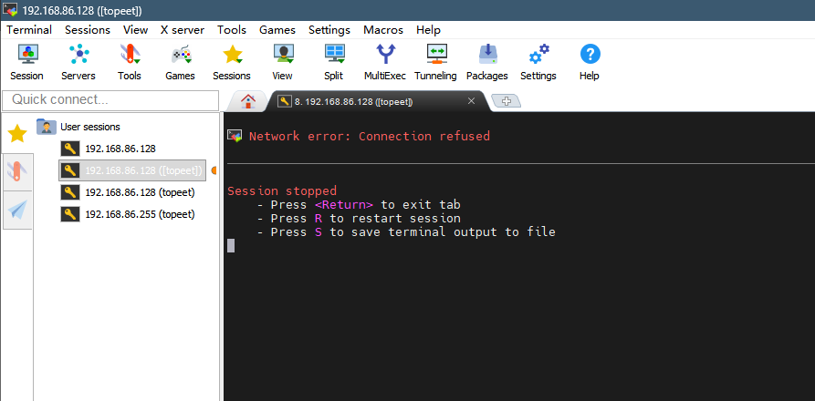

### 原因

Ubuntu 尚未安装或启动 OpenSSH Server，因此远程客户端无法建立 SSH 连接。

### 解决办法

在 Ubuntu 终端执行：

```bash
sudo apt update
sudo apt install -y openssh-server
sudo systemctl enable --now ssh
systemctl status ssh
hostname -I
```

命令作用：

- 安装 OpenSSH Server；
- 设置 SSH 服务开机启动并立即启动；
- 检查服务状态；
- 查询 Ubuntu 的 IP 地址。

### 验证结果

使用 `hostname -I` 输出的 IP 地址重新连接，MobaXterm 可以正常进入 Ubuntu。

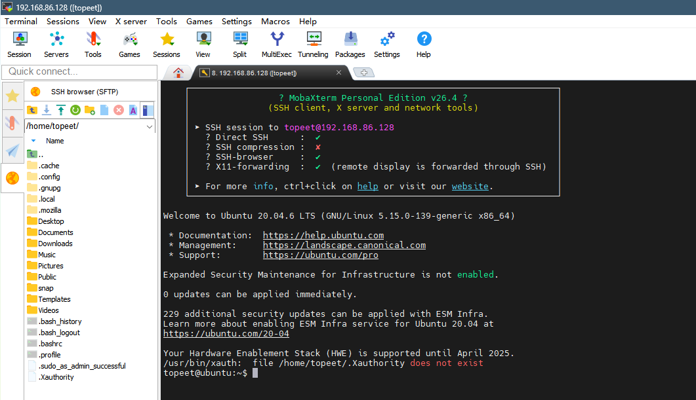

## 3. Miniconda 安装被 Ctrl+C 中断

### 问题现象

Miniconda 安装过程被 `Ctrl+C` 中断。再次直接运行安装脚本时，安装程序检测到目标目录已经存在，无法按照全新安装流程继续。

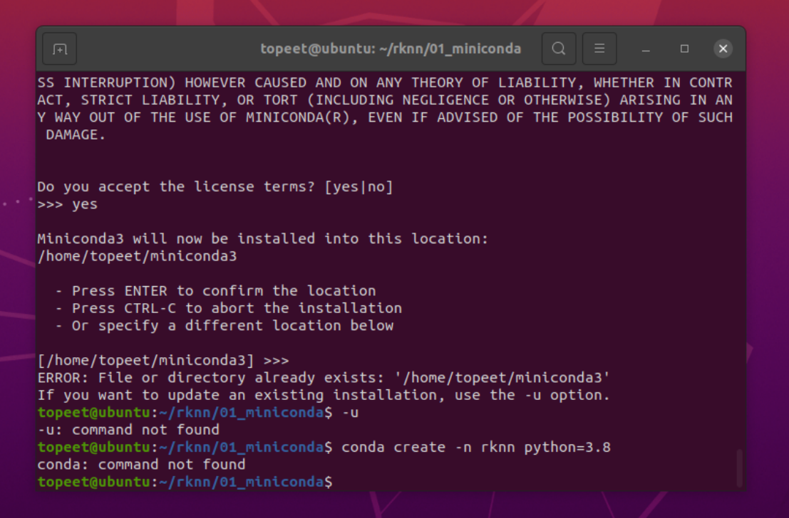

### 解决办法

使用更新参数重新执行安装脚本：

```bash
bash Miniconda3-latest-Linux-x86_64.sh -u
```

进入 Conda 基础环境：

```bash
source ~/miniconda3/bin/activate
```

激活已经创建的 RKNN 环境：

```bash
conda activate rknn
```

### 补充现象

给普通用户 `topeet` 安装 Miniconda 后，切换到该用户会自动进入 `base` 环境。原记录确认这一行为可以关闭，但没有记录具体操作命令，因此本文不补写未经本次实践验证的步骤。

## 4. Ubuntu 虚拟机启动较慢

### 现象

虚拟机启动后可能需要约两分钟，屏幕上才开始出现启动文字。

### 当前结论

原记录只记录了现象，没有给出明确原因和修复结果。遇到相同情况时，应先等待系统完成启动，不要因为短时间黑屏立即判断启动失败。

## 5. VS Code 通过 Remote - SSH 连接 Ubuntu

### 初次配置

1. 在 VS Code 安装 **Remote - SSH** 扩展；
2. 配置 Ubuntu 的 IP、用户名和 SSH 端口；
3. 确保 Ubuntu 端 SSH 服务已启动；
4. 从 VS Code 发起远程连接。

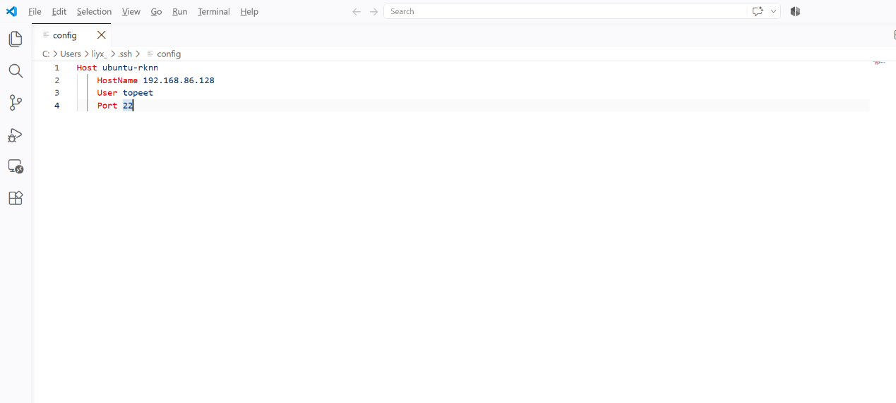

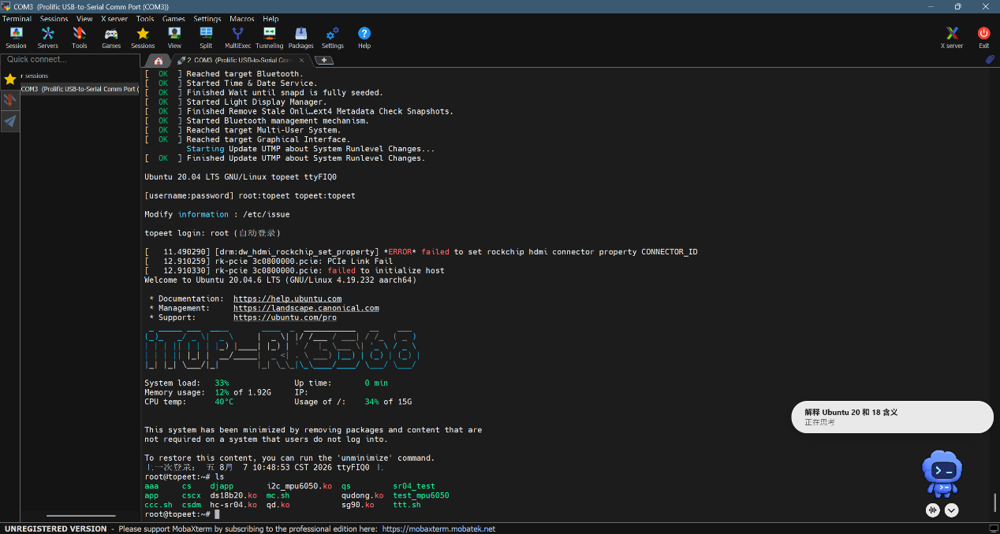

### Remote - SSH 更新后无法连接

#### 问题现象

Remote - SSH 自动更新后，出现 `CANNOT use API proposal: terminalDataWriteEvent` 等错误。SSH 服务本身没有变化，但扩展无法正常建立远程会话。

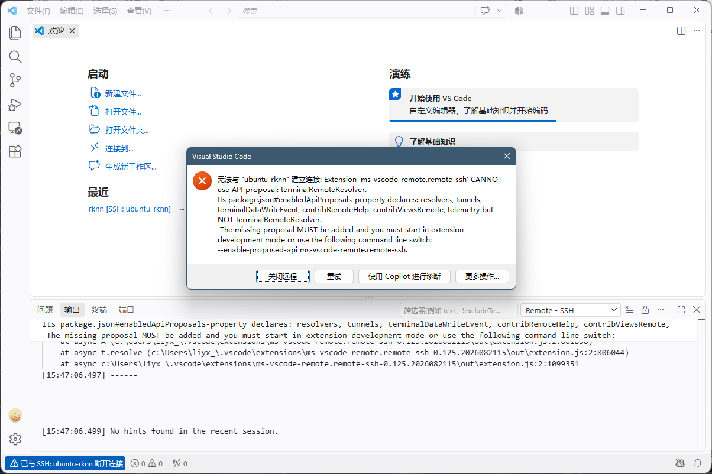

#### 解决办法

将 Remote - SSH 从预发布版本切回发布版本，或通过扩展菜单安装以前可用的特定版本。

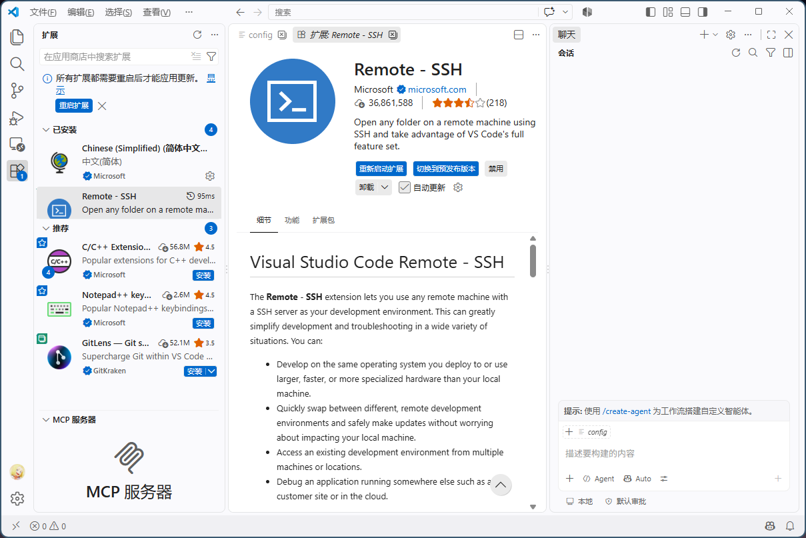

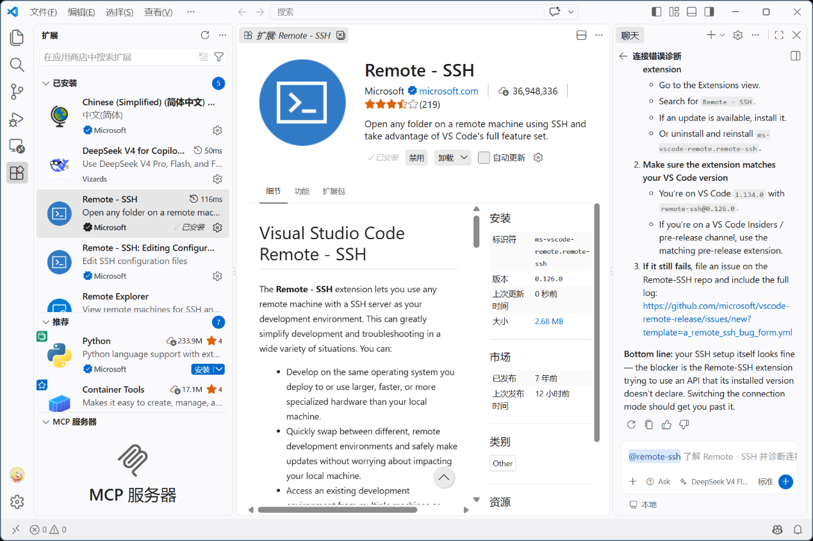

#### 排查原则

如果命令行 SSH 或 MobaXterm 仍能连接，而 VS Code 突然不能连接，应优先检查：

- Remote - SSH 是否刚刚自动更新；
- 当前安装的是发布版还是预发布版；
- 扩展版本是否与当前 VS Code 版本匹配。

## 6. 烧录、串口与开发板连接

### 连接线与虚拟机 USB 设备

开发板调试时同时连接：

- USB 3.0 数据线；
- 串口线。

在 VMware 中需要把对应 USB 串口设备连接给 Ubuntu 虚拟机。

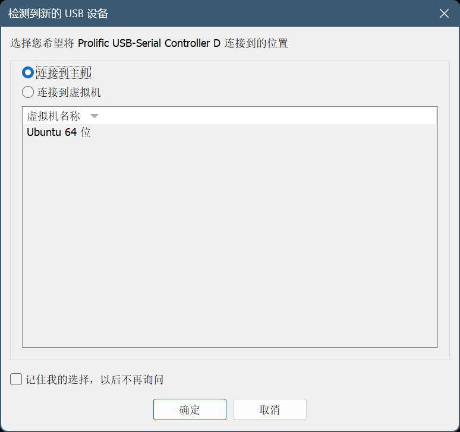

### Windows 无法看到串口

原记录中，重启电脑后系统能够识别 `COM3`，随后串口连接成功。

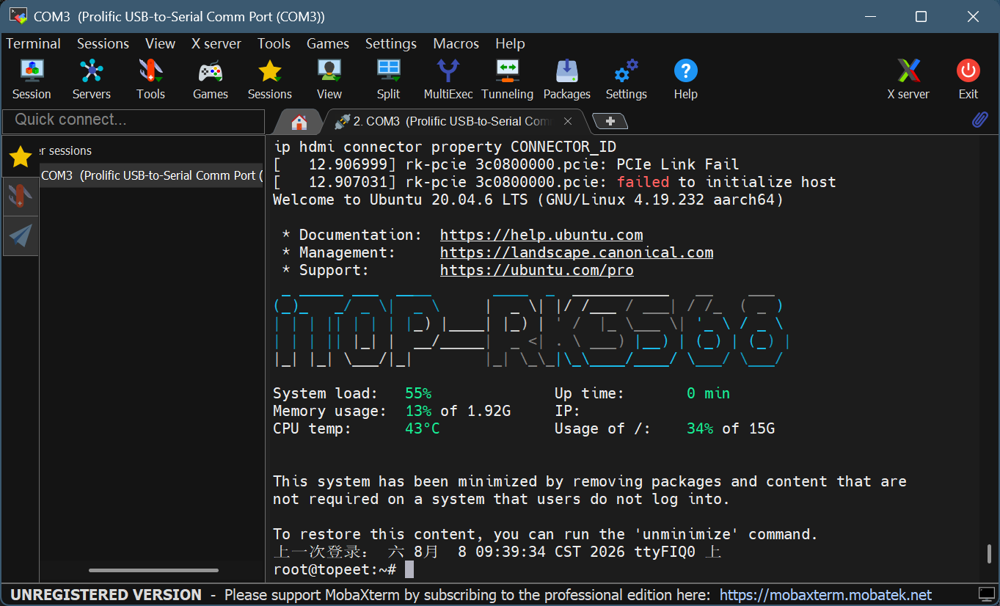

### 板卡连接判断

主机端工具出现设备标志，且终端能够看到开发板信息时，说明连接已经建立。

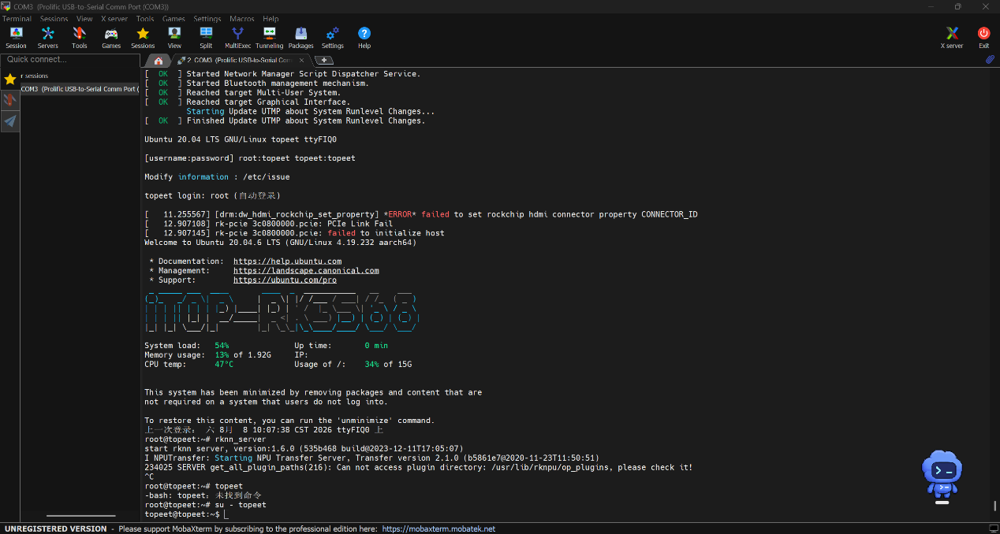

### 关于 `rknn_server`

本次实践中，所运行的连接或示例不需要手动启动 `rknn_server`。这个结论来自当前使用场景，不应推断为所有 RKNN 工具和所有部署方式都不需要该服务。

## 7. 板端用户、Wi-Fi 与文件传输

### 切换普通用户

从 `root` 切换到普通用户：

```bash
su - topeet
```

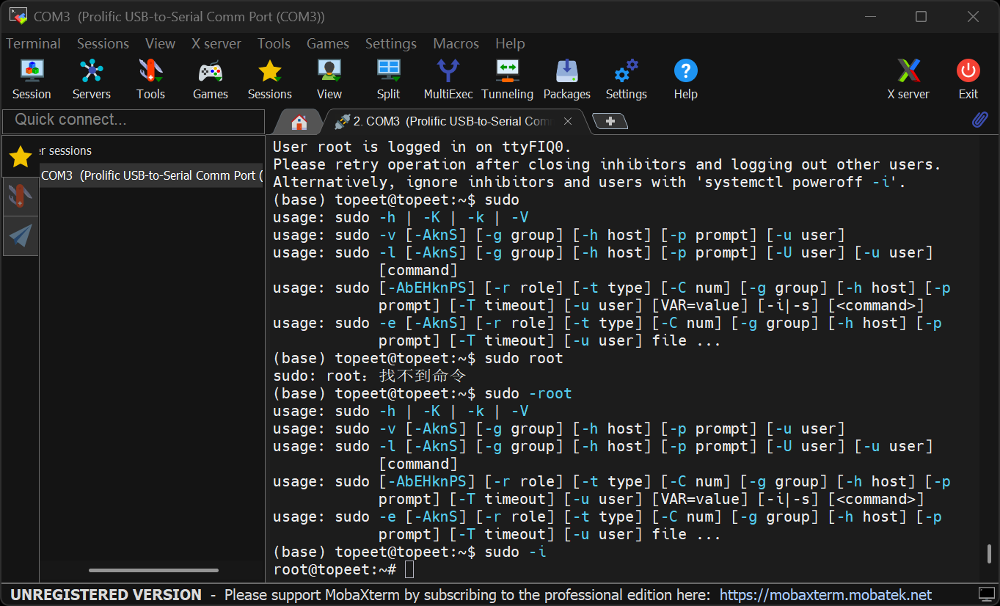

### 连接 Wi-Fi

开启 Wi-Fi 并扫描网络：

```bash
sudo nmcli radio wifi on
nmcli device wifi list
nmcli -t -f SSID,SIGNAL,SECURITY device wifi list
```

连接指定网络：

```bash
sudo nmcli --ask device wifi connect '<SSID>' ifname wlan0
```

使用 `--ask` 可以在终端交互式输入密码，避免把密码直接写进命令历史或 Git 仓库。

### 通过 SSH 传文件

开发板或 Ubuntu 开启 SSH 后，执行：

```bash
hostname -I
```

得到 IP 地址后，可以使用 MobaXterm 的 SSH/SFTP 面板传输文件。

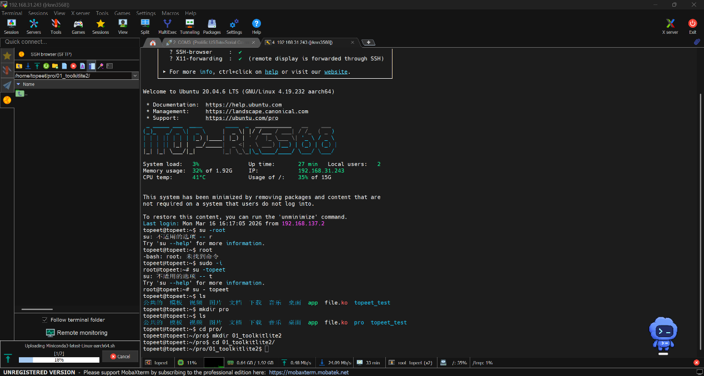

修改环境变量后，可执行：

```bash
source ~/.bashrc
```

### 待确认事项

原记录提出“板端是否需要配置国内软件源”的问题，但没有完成验证，因此暂不写成配置建议。

## 8. RKNN 环境与推理记录

### 环境部署

在 Ubuntu/远程环境中部署 RKNN 相关 Python 包和示例。

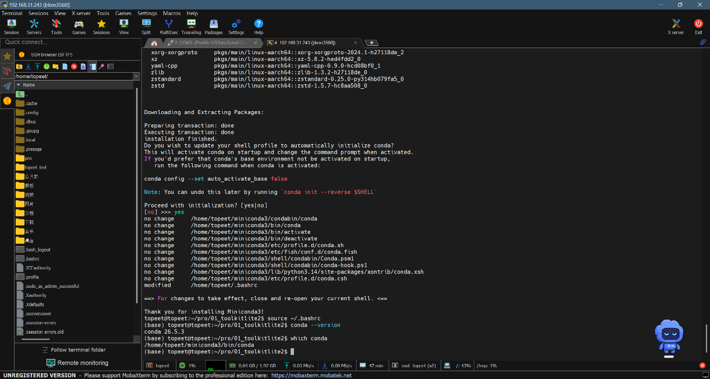

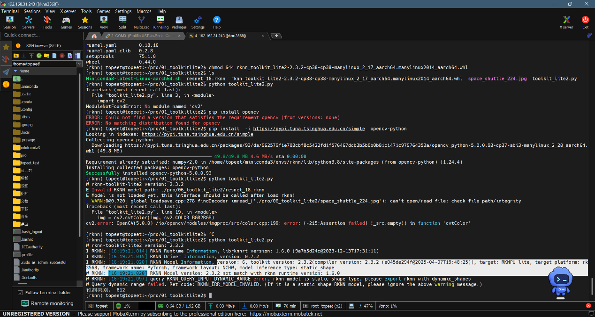

### Runtime 与 NPU 驱动版本

检查时发现 Runtime 和 NPU 驱动版本偏低，可能影响后续模型运行。

> 状态：原记录明确写着“到目前为止还没有更新”，因此这是待处理项，不是已经解决的问题。

### 模型运行方式的实践结论

- `.rknn` 模型需要结合对应 RKNN Runtime/板端环境运行；
- 加载 PyTorch 等源模型并执行转换、量化时，可以使用工具提供的模拟运行流程进行验证；
- MobileNetV2 示例在本次实验中正常运行。

### 板端推理结果

RKNN 示例已经能够在 RK3568 目录下运行并输出推理耗时与 Top5 结果。

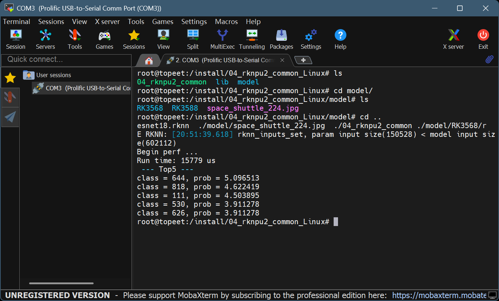

截图中还出现了输入大小不一致提示，因此“程序能输出结果”不等于输入配置完全正确，后续仍需核对模型输入尺寸与实际缓冲区大小。

## 9. 摄像头与 OpenCV

### 硬件确认

插入摄像头模块并给开发板上电，先检查系统是否识别设备。

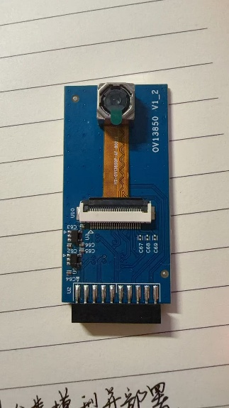

### Python 环境依赖

在 `rknn` 环境中安装 OpenCV：

```bash
pip install opencv-python
```

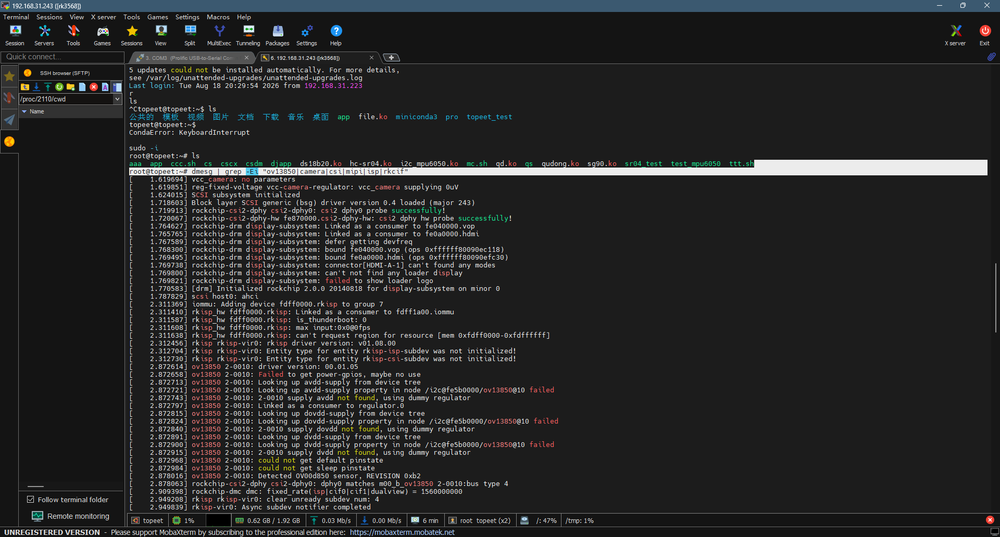

### 验证结果

通过 MobaXterm SSH 进入远程 `rknn` 环境，执行 OpenCV 取帧代码，成功获取摄像头画面。

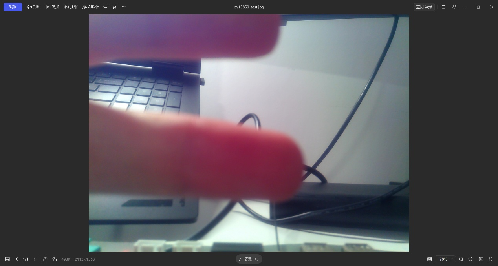

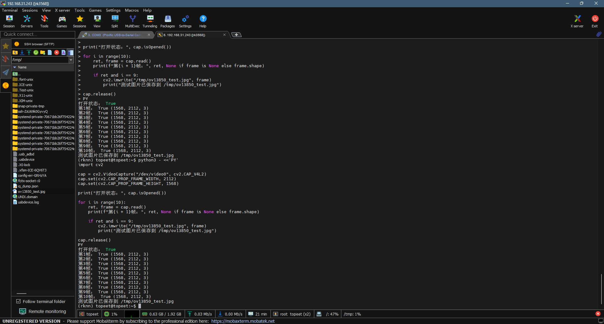

## 10. VS Code、CMake、编译器与头文件

### 先区分各组件职责

VS Code 的 C/C++ 扩展、CMake 和编译器不是同一个程序：

```text
CMakeLists.txt
      ↓ cmake读取配置
生成Makefile
      ↓ make调度
调用gcc/g++编译
```

C/C++ 扩展主要负责编辑器中的代码分析、补全和报错提示。它不会自动等价于真实编译器，也不一定自动理解 `CMakeLists.txt` 中的所有包含路径。

### 编辑器提示找不到外部库

需要在 `.vscode/c_cpp_properties.json` 中配置相关头文件搜索路径，让 C/C++ 扩展知道外部库的位置。

### 已配置外部库，标准头文件仍报错

#### 原因

`c_cpp_properties.json` 可以告诉扩展外部库在哪里，但系统没有安装 GCC/G++ 时，扩展仍可能无法定位 C/C++ 标准库头文件。

#### 解决办法

```bash
sudo apt install gcc g++ -y
```

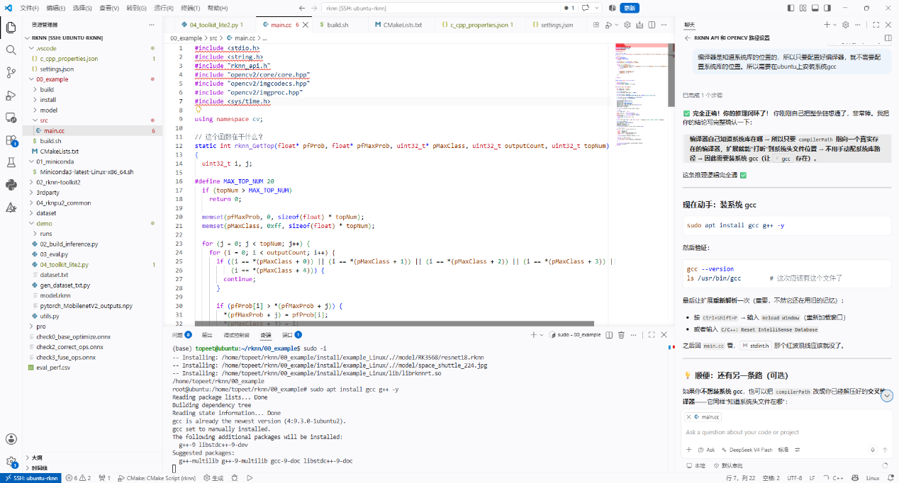

## 11. AArch64 交叉编译器解压与构建

### Windows 端无法正常解压

在 Windows 端解压交叉编译器压缩包时出现错误。

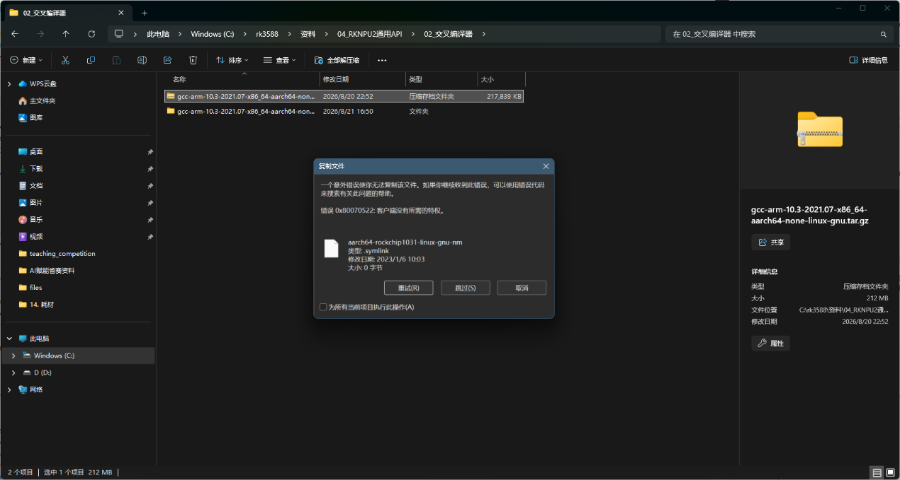

### 解决办法

把压缩包复制到 Ubuntu，在 Linux 中解压到目标目录：

```bash
sudo tar -xzf gcc-arm-10.3-2021.07-x86_64-aarch64-none-linux-gnu.tar.gz \
  -C /usr/local/arm64
```

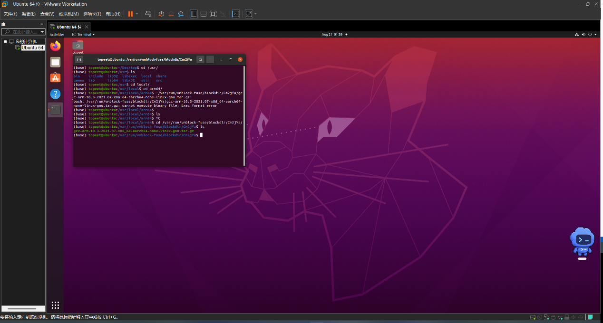

### 缺少 CMake 和 Make

```bash
sudo apt update
sudo apt install cmake make -y
```

安装依赖并配置工具链后，`build.sh` 可以成功运行。

## 12. 使用 ADB 推送安装目录

在 Ubuntu 终端把 `install` 目录推送到开发板根目录：

```bash
adb push install /
```

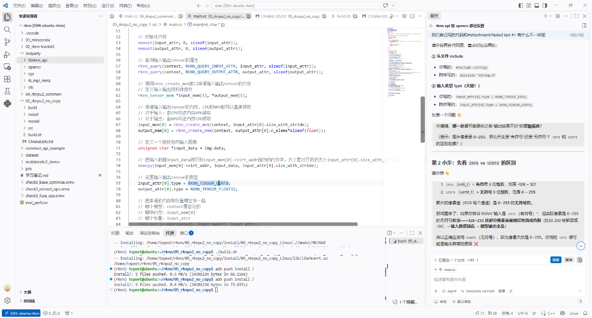

执行前应确认开发板已通过 ADB 正常连接，并确认目标路径具有写入权限。

## 13. 图像输入使用 `int8` 导致数值异常

### 问题背景

普通 8 位图像的像素通常位于 `0～255`。如果将这类无符号数据直接按照有符号 `int8` 解释，其有效范围只有：

```text
-128～127
```

因此大于 127 的像素无法按原值表达，可能发生截断、溢出或错误解释，最终造成图像或推理输入异常。具体表现取决于复制、类型转换和 RKNN 输入配置方式，不能一概写成“所有值都会变成 127”。

### 本次修改

代码中将图像输入类型改为无符号 8 位：

```cpp
input_attr[0].type = RKNN_TENSOR_UINT8;
```

同时保持输出类型符合模型与后处理要求，例如截图中记录为：

```cpp
output_attr[0].type = RKNN_TENSOR_FLOAT32;
```

### 排查原则

遇到图像亮度、颜色或推理结果异常时，检查：

- 原始图像缓冲区是 `uint8_t` 还是 `int8_t`；
- RKNN 输入属性中的 tensor type 是否一致；
- 模型是否要求量化输入，以及对应的 scale/zero-point；
- 输入尺寸和 `size_with_stride` 是否匹配。

## 14. 快速命令索引

### SSH

```bash
sudo apt update
sudo apt install -y openssh-server
sudo systemctl enable --now ssh
systemctl status ssh
hostname -I
```

### Conda

```bash
bash Miniconda3-latest-Linux-x86_64.sh -u
source ~/miniconda3/bin/activate
conda activate rknn
```

### Wi-Fi

```bash
sudo nmcli radio wifi on
nmcli device wifi list
sudo nmcli --ask device wifi connect '<SSID>' ifname wlan0
```

### 编译依赖

```bash
sudo apt update
sudo apt install cmake make gcc g++ -y
```

### 交叉编译器

```bash
sudo tar -xzf gcc-arm-10.3-2021.07-x86_64-aarch64-none-linux-gnu.tar.gz \
  -C /usr/local/arm64
```

### ADB

```bash
adb push install /
```

## 15. 待办事项

- 更新或核对 RKNN Runtime 与 NPU 驱动版本；
- 核对模型输入尺寸与 RKNN 输入缓冲区大小；
- 决定板端是否需要配置合适的软件源；
- 如果虚拟机持续启动缓慢，再单独排查虚拟机资源、磁盘和启动日志。
