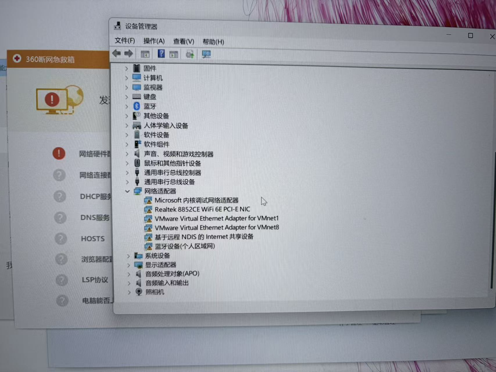
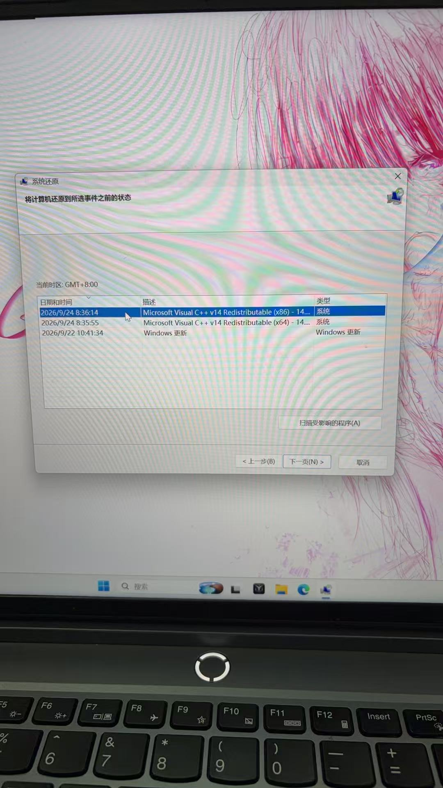
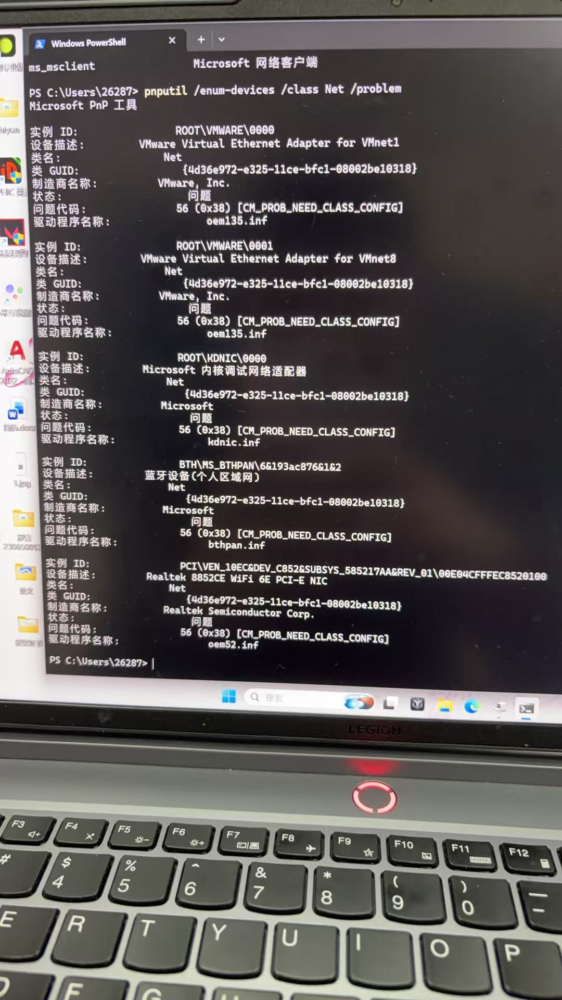
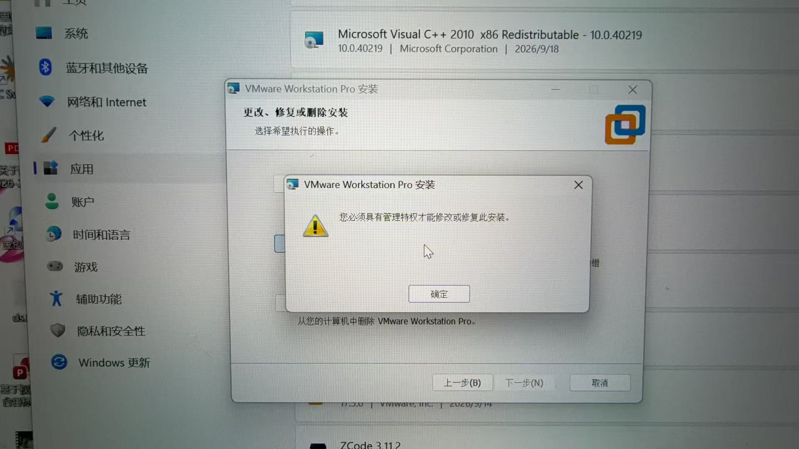
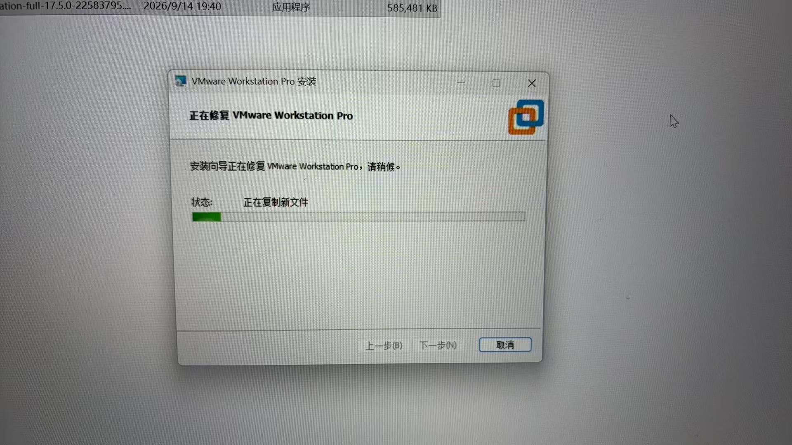
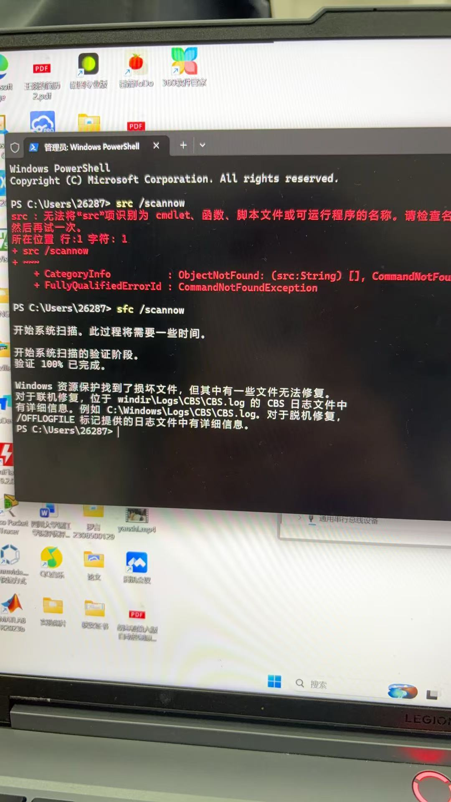
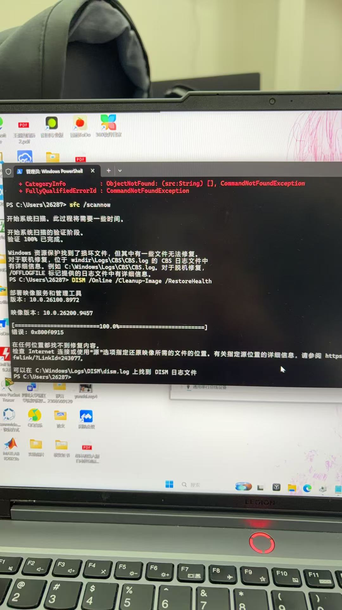

# Windows 网络重置后断网、代码56与系统还原图文记录

> 记录日期：2026-09-24。适用于本次 RK3568 开发环境所用的 Windows 主机，不是开发板系统烧写教程。
>
> **当前状态：已找到网络重置前的还原点，尚未提供“扫描受影响的程序”的结果，也尚未确认执行还原或网络恢复。本文不是已验证成功的修复方案。**

## 1. 故障经过与环境

故障前电脑可以正常上网，但无法开启移动热点。执行网络重置后，Wi-Fi 选项消失、无法联网，多个网络适配器出现黄色感叹号和代码56。因此，本次要先恢复主机联网，再单独排查热点问题。

| 项目 | 本次环境 |
|---|---|
| 电脑 | 联想拯救者 Y7000P IRX9，机型 83DG |
| 系统 | Windows 11 家庭版中文版，x64 |
| DISM 显示的系统映像版本 | 10.0.26200.9457 |
| 无线网卡 | Realtek 8852CE WiFi 6E PCI-E NIC |
| 虚拟化软件 | VMware Workstation Pro 17.5.0 |
| 需要保留的内容 | 虚拟机、代码、Python／Conda 环境及 RK3568 开发依赖 |



图1：故障后的设备管理器。多个网卡同时异常，不能直接认定为单个无线网卡驱动缺失。

## 2. 先区分三个操作

| 操作 | 作用 | 对环境的影响 |
|---|---|---|
| 网络重置 | 移除网络适配器并重新安装，恢复网络配置 | 固定 IP、VPN、虚拟网络等可能需要重新配置；本次故障出现在此操作之后 |
| 系统还原 | 使用已有还原点回退系统文件、注册表、驱动和程序状态 | 通常不影响个人文件，但还原点之后安装或修改的软件、驱动可能受影响 |
| 重置此电脑 | 重新安装 Windows | 即使选择“保留我的文件”，仍会移除应用和设置，不能理解为保留完整开发环境 |

本次准备尝试的是 **系统还原（`rstrui`）**，没有执行“重置此电脑”。已有多个网卡报代码56时，不应反复进行网络重置。

参考：[微软网络故障排查](https://support.microsoft.com/zh-cn/windows/experience/connectivity-networking/fix-wi-fi-connection-issues-in-windows)、[备份、还原和恢复](https://support.microsoft.com/zh-CN/Windows/Experience/Backup-Recovery/backup-restore-and-recovery-in-windows)、[重置电脑的影响](https://support.microsoft.com/zh-cn/windows/experience/backup-recovery/reset-your-pc)。

## 3. 系统还原：先检查还原点和受影响程序

### 3.1 操作前保存开发环境

- 保存代码和正在编辑的文件，正常关闭虚拟机。
- 将重要项目和虚拟机文件夹备份到独立存储位置。虚拟机备份应包含 `.vmx`、`.vmdk`，以及存在的快照相关文件；不要只复制配置文件。
- 记录自定义 NAT、桥接、固定 IP 等配置。
- 宿主机中的 Python／Conda、运行库、驱动和环境变量可能随还原受到影响；虚拟机内部环境通常保存在虚拟磁盘中，但仍应先备份，不作绝对保留承诺。

### 3.2 打开系统还原

1. 按 **Win + R**。
2. 输入 `rstrui`，按回车。
3. 点击“下一步”；若出现“显示更多还原点”，勾选它。
4. 选择故障发生前、尽量接近故障时间的还原点。

本次日志记录的首次网络重置为 **2026-09-24 09:24**。列表中有以下还原点：

| 日期和时间 | 描述 | 判断 |
|---|---|---|
| 2026-09-24 08:36:14 | Microsoft Visual C++ v14 Redistributable（x86） | 重置前最近的候选点，优先检查 |
| 2026-09-24 08:35:55 | Microsoft Visual C++ v14 Redistributable（x64） | 同样早于网络重置 |
| 2026-09-22 10:41:34 | Windows 更新 | 更早，可能回退更多变更 |



图2：本次找到的还原点。其他电脑应按自己的故障时间选择，不能照抄此日期。

**还原点描述中的 Visual C++ 只是创建还原点时的事件，不代表只还原 Visual C++。**

### 3.3 扫描受影响程序

选中候选还原点后，点击 **“扫描受影响的程序”**，查看将删除、恢复或可能需要重新安装的软件和驱动。重点检查 VMware、Visual C++ 运行库、Rockchip／ADB 驱动及其他开发工具。

**本次记录停留在这里：尚未收到扫描结果，尚未执行下面的还原步骤。**

### 3.4 确认影响后执行还原（后续参考步骤）

确认备份完成、受影响程序可以接受后：

1. 关闭扫描结果，点击“下一步”。
2. 核对还原点时间和目标系统，再点击“完成”，按提示确认。
3. 保持接通电源，等待还原和重启完成，不要强制关机。
4. 查看系统还原是否成功，再检查 Wi-Fi 选项、网卡状态及实际联网。
5. 检查 VMware 能否打开原虚拟机，虚拟机内的项目和环境能否运行。

如果没有合适的还原点，或者还原失败，应按错误信息继续诊断；不要把“重置此电脑”当作保留环境的等价替代方案。

## 4. 已执行的排查及结果

下表是本次实际经历，不是要求其他读者按顺序重复所有操作。

| 排查／操作 | 本次结果 |
|---|---|
| 网络重置后重启 | Wi-Fi 未恢复，代码56仍存在 |
| 安装联想官方无线网卡驱动 | 系统已有匹配版本，日志显示未更新设备 |
| 修复 VMware | 未恢复网络；日志显示桥接组件卸载失败、虚拟网卡安装后配置超时 |
| 查询异常网卡 | 无线、VMware、蓝牙网络、微软调试网卡均报代码56 |
| SFC 检查 | 找到损坏文件，但部分无法修复 |
| DISM 修复 | 报错 `0x800f0915`，找不到修复内容 |
| 查看系统还原点 | 已找到故障前候选点，恢复效果待验证 |

### 4.1 查询网卡状态

设备管理器 → 网络适配器 → 双击 Realtek 无线网卡 → **常规 → 设备状态**。

“事件”页只显示历史安装事件，不能替代当前设备状态。代码56表示 Windows 仍在设置设备类配置，并不等同于缺驱动或硬件损坏。[微软代码56说明](https://learn.microsoft.com/zh-cn/windows-hardware/drivers/install/cm-prob-need-class-config)

在管理员 PowerShell 中分别运行以下只读查询：

```powershell
pnputil /enum-devices /class Net /problem
netcfg /s n
```

`Net` 与 `/problem` 之间必须有空格。误写成 `Net/problem` 时，“找不到任何设备”不能作为没有故障设备的证据。



图3：多个网络设备同时停留在 `CM_PROB_NEED_CLASS_CONFIG` 状态。

`netcfg /s n` 列出网络组件。看到 VMware Bridge Protocol 或 Hyper-V 组件，只能证明它们存在，不能据此认定发生冲突。命令参考：[PnPUtil](https://learn.microsoft.com/windows-hardware/drivers/devtest/pnputil-command-syntax)、[netcfg](https://learn.microsoft.com/windows-server/administration/windows-commands/netcfg)。

### 4.2 官方无线驱动

本次下载联想的 [Realtek WLAN 驱动](https://support.lenovo.com/au/en/downloads/ds566637)，文件为 `tyy5077ffsnecrf0.exe`，包含 8852CE 驱动 `6001.16.126.323`。用能联网的电脑下载，经 U 盘复制到故障电脑安装，再重启。

下载页面的“自动检测”会检测当前浏览网页的电脑。用另一台电脑下载时应按故障电脑的型号或序列号核对，不能用当前电脑的自动检测结果代替。

日志显示故障电脑已有这一匹配版本：`Already Imported`、`Selected | Installed`、`Device does not need an update`。因此，安装同一个驱动并没有解决问题，也没有证据支持继续重复安装。

### 4.3 VMware 修复及权限提示

1. 正常关闭虚拟机并退出 VMware。
2. 按 **Win + R**，输入 `appwiz.cpl`，选择 VMware 的“更改”，查找“修复”。
3. 如果提示需要管理员权限，退出向导，使用匹配版本的原安装包，右键“以管理员身份运行”。
4. 确认操作为 **修复（Repair）**，完成后重启。



图4：没有获得管理员权限时的提示；运行桌面快捷方式不等于运行安装包。



图5：本次实际进入了修复流程，但修复后网络仍未恢复。

修复 VMware 通常不删除虚拟磁盘中的系统和依赖，但虚拟网络配置可能变化。本次没有通过关闭 Hyper-V、关闭安全功能或卸载 VMware 来验证原因，也不能把这些操作写成必要步骤。

### 4.4 设备安装日志中的线索

设备安装日志位于：

```text
C:\Windows\INF\setupapi.dev.log
```

可复制日志，经 U 盘转移分析。本仓库仅保留相关结论，不发布包含完整本机路径和设备标识的原始日志。日志用途见[微软说明](https://learn.microsoft.com/en-us/windows-hardware/drivers/install/setupapi-device-installation-log-entries)。

| 时间（2026-09-24） | 日志事件 | 能说明什么 |
|---|---|---|
| 09:24、10:08 | `netcfg.exe -d` 删除网络设备 | 确实发生过网络重置 |
| 09:45—09:49 | USB 网络共享设备配置超时，`0x000005B4` | 问题不限于无线网卡 |
| 10:28 | Realtek 驱动已经导入，设备不需要更新 | 本次安装没有替换现有匹配驱动 |
| 11:01、11:03 | VMware `-- uninstall bridge` 返回 `0x8007007e` | 桥接组件卸载失败；缺少的具体模块未被此日志指出 |
| 11:03—11:11 | VMnet1／VMnet8 安装后配置超时，仍为代码56 | VMware 修复没有完成网络恢复 |

`0x8007007e` 表示找不到指定模块，但不能仅据此断定缺失的是 Windows 文件还是 VMware 文件。安装段落最终出现 `SUCCESS`，也不等于设备已经正常工作，必须同时查看超时、问题代码和实际状态。

## 5. 系统文件检查：SFC 与 DISM

以下命令在 **终端（管理员）** 中运行。微软常规修复流程先运行 DISM，再运行 SFC；本次因主机断网，先用 SFC 检查本地系统文件，随后尝试 DISM。[微软修复说明](https://support.microsoft.com/zh-cn/windows/experience/backup-recovery/use-the-system-file-checker-tool-to-repair-missing-or-corrupted-system-files)

### 5.1 SFC

```powershell
sfc /scannow
```



图6：上方红字源于第一次误输入 `src`；下方正确的 `sfc /scannow` 已完成检查。

实际结果：**Windows 资源保护找到了损坏文件，但其中有一些文件无法修复。** 这证明存在系统文件损坏，尚不能证明损坏由网络重置造成，也不能证明这些文件就是断网的根因。

### 5.2 DISM

```powershell
DISM /Online /Cleanup-Image /RestoreHealth
```

`/Online` 表示针对当前运行的 Windows，不表示电脑已经联网。默认修复源可能需要访问 Windows 更新；断网时若本地源不足，修复可能失败。



图7：本次进度达到100%，但最终报错 `0x800f0915`，不能当作修复成功。

如确认有线网络可用，可联网后重试；本次有线网卡未出现在异常查询列表中，但这不足以证明有线联网一定可用。若仍失败，需要分析日志并提供匹配的修复源：

```text
C:\Windows\Logs\CBS\CBS.log
C:\Windows\Logs\DISM\dism.log
```

离线修复源需要与系统版本、语言、体系结构及所需组件匹配。目标系统补丁级别高于源时可能修复失败，不能随意下载一份 Windows ISO 后直接指定来源。具体 `/Source` 命令应在确认介质盘符、WIM／ESD 文件和映像索引后生成。[修复源要求](https://learn.microsoft.com/en-gb/windows-hardware/manufacture/desktop/configure-a-windows-repair-source?view=windows-11)

## 6. 后续验证与记录

- [ ] 扫描并记录还原点影响的程序。
- [ ] 完成备份后决定是否执行系统还原，记录成功或失败信息。
- [ ] 检查 Realtek 无线网卡和其他网络设备是否仍报代码56。
- [ ] 检查 Wi-Fi 选项、连接无线网络及实际网页访问。
- [ ] 检查 VMware、虚拟机网络及原有开发环境。
- [ ] 主机联网恢复后，再单独排查原先的移动热点问题。

不要将“找到还原点”“SFC 已运行”或“安装程序完成”写成“网络已修复”。以实际验证结果更新本文。
