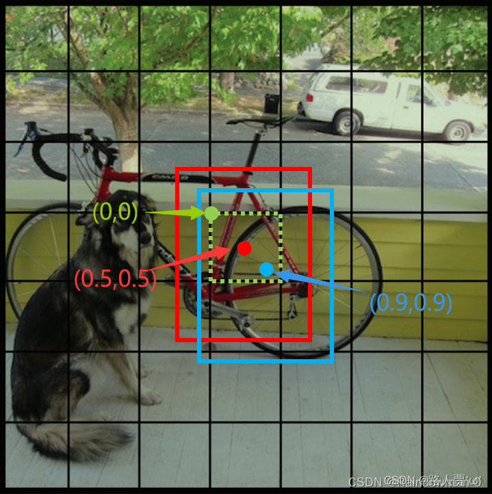
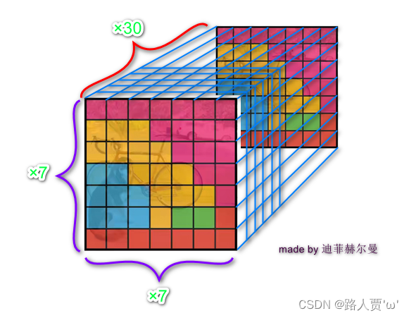
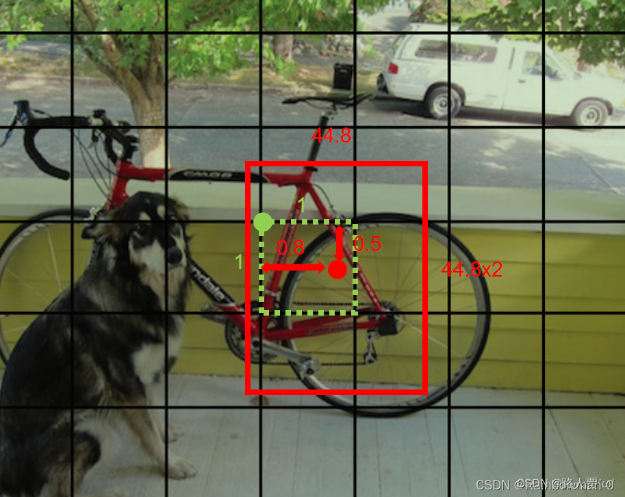
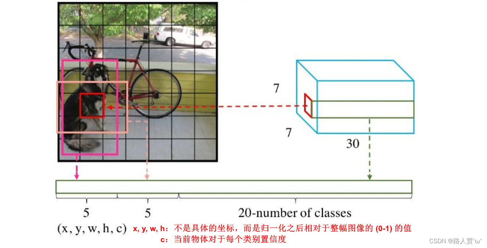
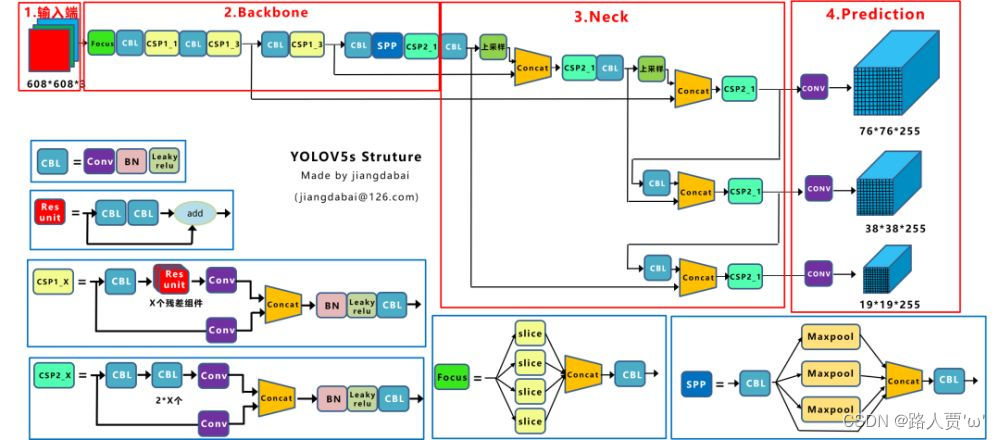
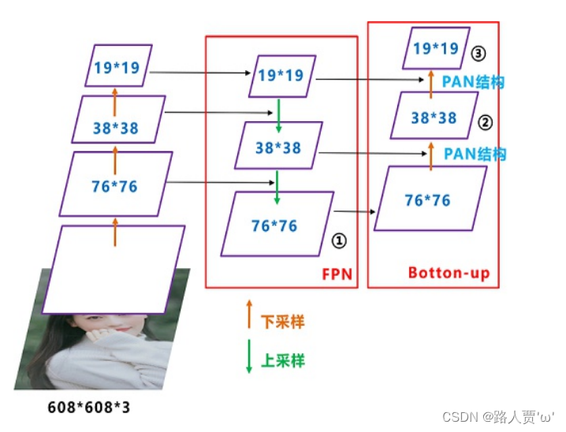

# 从 YOLOv1 到 YOLOv5：核心原理学习笔记

> 学习目标：理解 YOLO 的输出张量、grid cell、bbox、置信度、损失函数与 NMS，并在此基础上理解 YOLOv5 的多尺度检测、FPN/PAN、CSP 和 Anchor。

## 1. 目标检测究竟输出什么

图像分类只需要回答“图片中主要是什么”，目标检测还需要回答：

- 目标在哪里：边界框 bbox；
- 目标是什么：类别；
- 预测是否可靠：置信度。

一个 bbox 通常用中心点与宽高表示：

$$
(x,y,w,h)
$$

其中 `x, y` 是 bbox **中心点**，不是左上角。

## 2. YOLOv1 的 grid cell

YOLOv1 将整张图片划分为 `S × S` 个 grid cell。一个目标的 bbox 中心落在哪个 cell，就由哪个 cell 负责该目标。

需要注意：

- grid cell 是预测任务的“负责人”，不是裁剪出来单独检测的小图片；
- 整张图片只经过一次 CNN；
- bbox 可以跨越多个 cell；
- 决定负责 cell 的是 bbox 中心点，而不是 bbox 覆盖范围；
- 深层特征具有较大感受野，因此一个 cell 不只利用其格子范围内的像素。



*图：同一 grid cell 内，中心点可以用相对于 cell 左上角的 `(x, y)` 偏移表示。*

### 2.1 全图坐标、网格坐标与局部偏移

假设目标中心相对于整张图片的归一化坐标是：

$$
(x_c,y_c)=(0.46,0.38)
$$

网格为 `7 × 7`，转换到网格坐标：

$$
x_g=0.46\times7=3.22
$$

$$
y_g=0.38\times7=2.66
$$

整数部分确定 cell 编号，小数部分是 cell 内局部偏移。以下行列编号均从 0 开始，列从左向右、行从上向下：

$$
(col,row)=(3,2)
$$

$$
(x_{offset},y_{offset})=(0.22,0.66)
$$

在网格坐标系中，每个 cell 的尺寸正是 `1 × 1`。`3.22` 表示横向走过 3.22 个 cell：已经完整经过 3 个 cell，又进入列索引为 3 的 cell（从左数第 4 列）的 22%。

三个坐标系的关系如下：

| 坐标系 | 整张图大小 | 每个 cell 大小 |
|---|---:|---:|
| 像素坐标（图片为 700×700） | 700×700 | 100×100 |
| 全图归一化坐标 | 1×1 | 1/7×1/7 |
| 网格坐标 | 7×7 | 1×1 |

全局像素坐标可以直接计算：

$$
X_{pixel}=x_cW,\qquad Y_{pixel}=y_cH
$$

也可以由 cell 编号和局部偏移还原：

$$
X_{pixel}=(col+x_{offset})\frac{W}{S}
$$

$$
Y_{pixel}=(row+y_{offset})\frac{H}{S}
$$

## 3. YOLOv1 的输出张量

YOLOv1 的输出格式为：

$$
S\times S\times(5B+C)
$$

其中：

- `S × S`：grid cell 数量；
- `B`：每个 cell 预测的候选 bbox 数量；
- `C`：类别数量；
- 每个 bbox 的 5 个值：`(x, y, w, h, c)`。



*图：YOLOv1 将每个 grid cell 的 30 个预测值组合为 `7 × 7 × 30` 输出张量。*

### 3.1 五个参数分别相对于什么

YOLOv1 不直接输出像素坐标。`(x, y, w, h)` 都是相对量，但它们参照的范围不同：

| 参数 | 含义 | 参照范围 |
|---|---|---|
| `x` | bbox 中心相对于负责 cell 左边界的水平偏移 | 当前 cell 的宽度，目标值通常在 `[0, 1)` |
| `y` | bbox 中心相对于负责 cell 上边界的垂直偏移 | 当前 cell 的高度，目标值通常在 `[0, 1)` |
| `w` | bbox 的相对宽度 | 整张输入图片的宽度 |
| `h` | bbox 的相对高度 | 整张输入图片的高度 |
| `c` | bbox confidence | 是否有目标及定位质量，不是坐标 |

因此：

$$
x=\frac{X_{center}-X_{cell\ left}}{W_{cell}},\qquad
y=\frac{Y_{center}-Y_{cell\ top}}{H_{cell}}
$$

$$
w=\frac{W_{box}}{W_{image}},\qquad
h=\frac{H_{box}}{H_{image}}
$$

假设负责 cell 的列、行索引分别为 `col, row`，网格为 `S × S`，输入图片为 `W_image × H_image`，则可以还原为：

$$
X_{center}=\frac{col+x}{S}W_{image},\qquad
Y_{center}=\frac{row+y}{S}H_{image}
$$

$$
W_{box}=wW_{image},\qquad
H_{box}=hH_{image}
$$



*图：仅用于帮助区分参照范围：`x, y` 描述中心在负责 cell 内的偏移，`w, h` 描述 bbox 相对于整张输入图片的宽高。图中的 `44.8`、`44.8×2` 与所画网格/红框比例并不一致，不应作为数值推导依据；计算请以正文公式为准。*

例如输入图片宽度为 700，网格为 `7 × 7`，目标由列索引 3 的 cell 负责，且 `x = 0.22`，那么：

$$
X_{center}=\frac{3+0.22}{7}\times700=322
$$

这里 `x` 乘的是 **cell 宽度**来得到 cell 内距离，而 `w` 乘的是 **整张图片宽度**来得到 bbox 实际宽度。两者不能混用。

以 Pascal VOC 配置为例：

$$
S=7,\quad B=2,\quad C=20
$$

因此：

$$
7\times7\times(5\times2+20)=7\times7\times30
$$

每个 cell 的 30 个数为：

```text
bbox 1: x1, y1, w1, h1, c1       5 个
bbox 2: x2, y2, w2, h2, c2       5 个
类别条件概率                       20 个
```

同一 cell 的两个 bbox 各自拥有坐标和置信度，但**共享一组类别概率**。因此多个 bbox 是多个候选方案，不代表该 cell 能稳定表达多个不同类别的目标。这也是 YOLOv1 面对多个目标中心落入同一 cell 时的局限之一。

模型一共先产生：

$$
7\times7\times2=98
$$

个候选框。



*图：YOLOv1 输出布局示意。图片底部红字仅供辅助观察，其中两处表述需以正文为准：`x, y` 相对于负责 cell，`w, h` 相对于整张输入图片；`c` 是 bbox confidence，而不是某个类别的置信度。*

## 4. bbox 置信度与类别得分

YOLOv1 中，bbox 置信度的目标含义是：

$$
c=P(object)\times IoU(pred,truth)
$$

它同时描述：

- 该位置是否有目标；
- 当前预测框与真实框的定位质量。

训练时存在真实框，可以计算 IoU 并监督 `c`：有目标的负责预测器以 IoU 为目标值，无目标或非负责预测器以 0 为目标值。推理时没有真实框，IoU **不是现场计算的**，而是网络根据训练经验直接预测 `c`。

某个 bbox 对类别 `k` 的最终得分为：

$$
score_k=c\times P(class_k\mid object)
$$

例如 `c = 0.6`，狗的条件类别概率为 0.8，则狗的最终得分为：

$$
0.6\times0.8=0.48
$$

## 5. 训练中的责任分配与损失

### 5.1 哪个 cell 负责

bbox 中心所在的 cell 负责该目标。

### 5.2 cell 中哪个 bbox 负责

YOLOv1 的一个 cell 预测 `B` 个 bbox。训练时，与真实框 IoU 最大的 bbox 预测器负责学习该目标的坐标：

$$
responsible\ bbox=\arg\max_b IoU(bbox_b,truth)
$$

非负责 bbox 不计算该目标的坐标损失。训练时它不是被直接删除，而是没有获得该目标的坐标监督，并受到相应置信度约束。

### 5.3 不同 cell 计算哪些损失

| 情况 | 坐标损失 | 类别损失 | 置信度损失 |
|---|---:|---:|---:|
| 有目标且 bbox 负责 | 计算 | 以 cell 为单位计算一次 | 计算 |
| 有目标但 bbox 不负责 | 不计算 | 不重复计算 | 按无目标项约束 `c → 0` |
| 没有目标 | 不计算 | 不计算 | 计算，使 `c → 0` |

类别损失不是对同一 cell 的两个 bbox 各算一次，因为它们共享类别概率。没有目标的 cell 也没有单独的“背景类”，主要通过 `c → 0` 表达背景。

### 5.4 为什么降低无目标损失权重

一张图片中大多数 cell 都是背景。如果所有背景置信度损失与目标损失具有同样权重，背景项会主导梯度，使模型强烈偏向输出较低的 `c`，进而造成漏检。

YOLOv1 使用：

$$
\lambda_{noobj}=0.5
$$

降低大量背景框对总损失的支配。同时提高坐标损失权重：

$$
\lambda_{coord}=5
$$

- `λ_noobj` 太大：模型过于保守，容易漏检；
- `λ_noobj` 太小：背景误报惩罚不足，容易误检。

### 5.5 为什么宽高损失使用平方根

同样是 10 像素误差，对宽 20 的小框是 50% 误差，对宽 200 的大框只有 5%。YOLOv1 不是“对平方误差开根号”，而是先分别对预测值与真实值开根号，再计算平方误差：

$$
(\sqrt{w_{pred}}-\sqrt{w_{truth}})^2
$$

平方根函数的斜率为：

$$
\frac{d\sqrt{w}}{dw}=\frac{1}{2\sqrt{w}}
$$

因此它在小数值附近更陡，使相同绝对尺寸变化对小框产生更大的损失。

## 6. 推理后处理：阈值筛选与 NMS

推理流程为：

```text
网络产生候选框
      ↓
还原到全图坐标
      ↓
计算 objectness × 类别概率，得到最终类别得分
      ↓
删除最终类别得分低于阈值的框
      ↓
按类别执行 NMS
      ↓
最终 bbox、类别与得分
```

得分阈值和 NMS 解决不同问题：

- 得分阈值：结合 objectness 与类别概率，判断该类别的框是否值得相信；
- NMS：删除同一目标周围的重复框。

本文后续若使用“最终置信度”，指的就是 `objectness × 类别概率`；它与网络单独输出的 objectness/bbox confidence 不是同一个量。具体实现也可能先用 objectness 做一次快速预筛。

NMS 通常在整张图片的同类别候选框之间执行，不限于同一个 cell，也不关心框来自哪个 cell。

基本步骤：

1. 按类别得分从高到低排序；
2. 保留最高分框；
3. 删除与它 IoU 高于 NMS 阈值的低分框；
4. 在剩余框中重复执行。

阈值权衡：

- NMS IoU 阈值过低：可能误删相互靠近的同类真实目标；
- NMS IoU 阈值过高：可能留下同一目标的多个重复 bbox。

## 7. YOLOv1 的网络结构

YOLOv1 的前向过程可简化为：

```text
448×448×3 输入
      ↓
CNN 提取特征
      ↓
7×7×1024
      ↓ Flatten
50176 维向量
      ↓ 全连接层
4096
      ↓ 全连接层
1470
      ↓ Reshape
7×7×30
      ↓
阈值筛选与 NMS
```

`1024` 表示每个空间位置的特征通道数，不是候选框数量。通道数是网络结构设计选择，并非 YOLO 输出格式强制要求。

全连接层使每个 cell 的预测能够使用全局特征，但也带来：

- 参数量与计算量巨大；
- 模型文件大；
- 容易过拟合；
- 输入与输出尺寸较固定；
- Flatten 弱化显式二维空间结构。

YOLOv1 使用 Dropout 缓解过拟合。后续 YOLO 采用全卷积检测头，避免这种巨大的全连接预测结构。

## 8. 从 YOLOv1 到 YOLOv5

YOLOv5 的主要变化包括：

| 方面 | YOLOv1 | YOLOv5 |
|---|---|---|
| 检测头 | Flatten + 全连接 | 全卷积检测头 |
| 检测尺度 | 单个 7×7 | 通常三个尺度 |
| 候选框 | 每个 cell 直接预测 B 个框 | 每个位置基于多个 anchor 预测 |
| 类别预测 | 同 cell 的 bbox 共享 | 每个 anchor 独立预测类别 |
| 特征融合 | 较弱 | FPN + PAN |
| 主干/模块 | 早期卷积结构 | CSP、SPP/SPPF 等 |
| 定位损失 | 坐标平方误差 | IoU 系列损失 |
| 工程实现 | 早期框架 | PyTorch、数据增强、迁移学习与多格式导出 |



*图：早期 YOLOv5s 结构示意，包括 Backbone、Neck 和三个 Prediction 分支。图中输入为 `608 × 608`，所以预测尺度是 `76 × 76`、`38 × 38` 和 `19 × 19`。*

> YOLOv5 迭代版本较多，具体模块可能随版本变化。例如早期结构图常见 Focus、LeakyReLU 和 SPP，后续常见实现可能使用不同 Stem、SiLU 与 SPPF。理解主干、Neck、检测头和多尺度预测比死记某一版模块更重要。

## 9. YOLOv5 的三个检测尺度

以 `640×640` 输入为例，YOLOv5 通常使用：

```text
80×80，stride=8   → 偏向小目标
40×40，stride=16  → 偏向中目标
20×20，stride=32  → 偏向大目标
```

如果输入为 `608×608`，对应尺寸是 `76×76、38×38、19×19`。

`stride=8` 表示特征图相邻位置在原图上约相隔 8 像素，不表示该位置只能利用原图 `8×8` 像素。感受野由多层卷积和下采样决定，通常远大于步长覆盖区域。

- 高分辨率特征保留更多位置和边缘细节，适合小目标；
- 低分辨率深层特征语义更强、感受野更大，适合大目标；
- 多尺度分工兼顾精度和计算效率。

## 10. FPN 与 PAN

两者都位于 YOLOv5 的 Neck。



*图：FPN 通过上采样把深层语义传向高分辨率层；PAN 再通过下采样把定位信息传回低分辨率层。*

### 10.1 FPN

FPN 全称 **Feature Pyramid Network（特征金字塔网络）**。它通过自顶向下路径，将深层语义传给高分辨率层：

```text
20×20 → 上采样 → 40×40 → 上采样 → 80×80
```

上采样结果需要与 Backbone 中同尺寸特征 Concat，因为单纯上采样只增加空间尺寸，不能恢复下采样时已经丢失的定位细节。融合后同时获得深层语义与浅层细节。

### 10.2 PAN/PANet

PAN/PANet 全称 **Path Aggregation Network（路径聚合网络）**。它增加自底向上路径，把定位信息重新传向低分辨率层：

```text
80×80 → 下采样 → 40×40 → 下采样 → 20×20
```

YOLOv5 Neck 中的下采样通常由 `stride=2` 的卷积完成。

```text
FPN：深层 → 浅层，传递语义
PAN：浅层 → 深层，传递定位信息
```

## 11. CBL 与 CSP

早期 YOLOv5 结构图中的 CBL 表示：

```text
Conv → BatchNorm → LeakyReLU
```

- Conv：学习和组合特征，`stride=2` 时还能下采样；
- BN：稳定不同层的特征数值分布和训练过程；
- LeakyReLU：引入非线性，并在负区间保留小梯度。

没有激活函数时，多层线性卷积组合后仍然是一个线性/仿射变换，无法充分表达复杂非线性规律。后续常见 YOLOv5 实现主要使用 SiLU 激活函数。

CSP 全称 **Cross Stage Partial Network（跨阶段局部网络）**。其思想是将特征分成不同路径：一部分经过复杂残差模块，另一部分走更直接的路径，最后 Concat。

作用包括：

- 保留更直接的特征和梯度传播路径；
- 减少所有通道都经过复杂模块造成的计算量；
- 减少重复特征与重复梯度信息。

`Add` 和 `Concat` 的区别：

- Add：对应元素相加，通道数不变；
- Concat：沿通道维度拼接，通道数相加。

若两路张量都是 `[N,64,40,40]`：

```text
Add    → [N,64,40,40]
Concat → [N,128,40,40]
```

Concat 前空间尺寸必须一致。

## 12. YOLOv5 的预测通道与张量变换

在 COCO 的 80 类任务上，每个检测位置通常使用 3 个 anchor，每个 anchor 输出：

$$
4\ bbox+1\ objectness+80\ classes=85
$$

所以检测卷积输出通道数为：

$$
3\times85=255
$$

YOLOv5 不使用 YOLOv1 的 Flatten + 全连接层，而是在三个尺度上分别使用 `1×1 Conv`：

```text
[N,Cin,H,W]
      ↓ 1×1 Conv
[N,255,H,W]
      ↓ reshape / permute
[N,3,H,W,85]
```

三个尺度分别产生候选框，解码后合并，再执行阈值筛选与 NMS。

每个检测头的每个 `H × W` 空间位置都会使用 3 个 anchor，因此该检测头产生 `3HW` 个原始候选框。对于 `640×640` 输入，三个尺度合计：

$$
3(80^2+40^2+20^2)=25200
$$

个原始候选框，之后再进行得分筛选和 NMS。

与 YOLOv1 不同，YOLOv5 每个 anchor 独立拥有：

```text
x, y, w, h, objectness, C 个类别概率
```

## 13. Anchor 到底是什么

Anchor 可以画成矩形，但它不是最终 bbox，而是训练前确定的**参考宽高模板**。

Anchor 通常来自训练集真实 bbox 宽高的统计或聚类，也可以手工配置。经典 YOLOv5 在 COCO 上的一组典型 anchor 如下；表中宽高是 `640×640` 网络输入坐标系下的像素尺寸示例：

| 检测头 | 主要尺度 | 3 个 anchor 示例 |
|---|---|---|
| 80×80 | 小目标 | (10,13)、(16,30)、(33,23) |
| 40×40 | 中目标 | (30,61)、(62,45)、(59,119) |
| 20×20 | 大目标 | (116,90)、(156,198)、(373,326) |

最容易混淆的关系是：

```text
不是：3 个 anchor 分别对应 3 个检测头

而是：3 个检测头 × 每个检测头 3 个 anchor
      = 共 9 种 anchor 尺寸模板
```

同一检测头的 3 个 anchor 通常属于相近尺度，但具有不同尺寸或宽高比。例如 `80×80` 检测头的三个 anchor 都偏小，并不是分别负责大、中、小目标。小、中、大只是经验上的尺度分工，不是严格互斥的类别；不同 YOLOv5 版本和匹配阈值可能让一个真实框匹配多个合适 anchor 或邻近网格位置。

模型在 anchor 基础上预测中心偏移、宽高变换、objectness 和类别。概念上：

$$
anchor\ 模板+网络预测的调整量\rightarrow候选\ bbox
$$

YOLOv5 常见宽高解码形式为：

$$
b_w=(2\sigma(t_w))^2a_w
$$

$$
b_h=(2\sigma(t_h))^2a_h
$$

其中 `a_w, a_h` 是 anchor 宽高，`t_w, t_h` 是网络输出，`b_w, b_h` 是解码后的候选框宽高。

Anchor 解码与原图尺寸还原是两个独立过程：

```text
Anchor + 网络调整量
        ↓
网络输入坐标系中的 bbox
        ↓ 撤销 Letterbox 的缩放与填充
原始图片坐标系中的 bbox
```

- Anchor 解码解决目标形状与参考模板不同的问题；
- 坐标还原解决网络输入尺寸与原始图片尺寸不同的问题。

## 14. 一条完整的 YOLOv5 推理链路

```text
原始图片
  ↓ Letterbox缩放与填充
固定尺寸网络输入
  ↓ Backbone
多层特征
  ↓ FPN + PAN Neck
融合后的三个尺度特征
  ↓ 三个全卷积检测头
[N,3,H,W,5+C] × 3个尺度
  ↓ 根据grid和anchor解码
输入坐标系中的候选bbox
  ↓ objectness × 类别概率
最终类别得分阈值筛选
  ↓
NMS删除重复框
  ↓ 撤销Letterbox变换
原图上的bbox、类别与置信度
```

## 15. 易错点速查

1. `x, y` 通常表示 bbox 中心，不是左上角。
2. cell 是预测责任单位，不是只看一小块图像的独立检测器。
3. `stride=8` 不等于感受野只有 `8×8`。
4. YOLOv1 的同 cell 多个 bbox 共享类别概率。
5. 推理时没有真实框，置信度中的定位质量由网络预测，不现场计算真实 IoU。
6. NMS 面向整张图的同类别候选框，不限于同一 cell。
7. 宽高损失是先对预测值和真实值分别开根号，再计算平方误差。
8. YOLOv5 的 `255=3×(5+80)`。
9. Anchor 是参考模板，不是最终 bbox，也不是针对每张图片临时生成的框。
10. 三个检测头各有三个 anchor，共 9 种模板，不是三个 anchor 一一对应三个检测头。
11. Anchor 解码与 Letterbox 坐标还原是两件不同的事。
